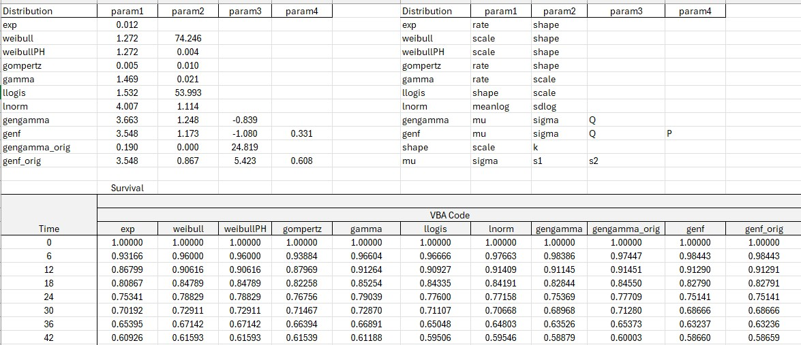

# Example: VBA Survival Functions (flexsurv Alignment)

## Overview

This example shows how survival functions implemented in Excel VBA reproduce results from `flexsurv` in R.

Model parameters are estimated in R, mapped to the correct distribution inputs, and then used in VBA functions to compute survival probabilities S(t) across a time grid.

---

## Example Workbook

---

## Distribution Details

Each column in the workbook corresponds to a distribution. The formulas evaluate:

S(t) = survival probability at time t

using parameters estimated in R.

---

### Exponential
